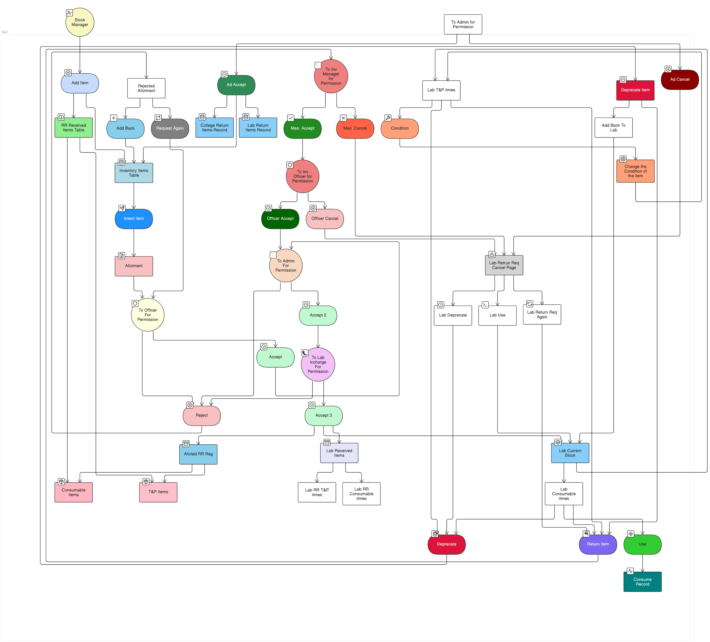

## 📦Goverment Polytechnic Inventory Management System – Data Flow Diagram (DFD)

This repository includes a detailed **Data Flow Diagram (DFD)** for the Inventory Management System.

### 🧭 Visual Flow (DFD Preview)

> 📝 This image represents the end-to-end flow of stock management, approvals, allotment, returns, and lab handling.

---

### 📁 Diagram Contents

- 🧑‍💼 **Users**: Stock Manager, Admin, Officer, Lab Incharge
- 📥 **Inputs**: Add Items, RR Received
- 🗄️ **Databases**: Inventory Items Table, Allotment, RR Received Items Table
- 🌀 **Processes**: Accept, Reject, Return Item, Deprecate
- 🖥️ **Web Pages**: Return Req Cancel Page, Lab Use

---
